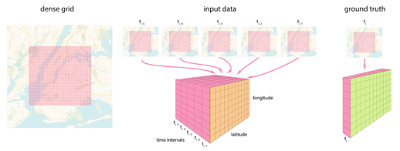

# Predicting City Status Task 
ITMO University - Machine Learning for Industrial Data 2023/2024

## Introduction
Social media occupies a very important place in modern human life and has a strong influence on daily life. A huge flow of information related to a person's thoughts, experiences, emotions, and the world that surrounds him/her is transmitted through them. Exploring social media streams allows you to observe processes taking place in the city, to predict emerging anomalies and events, allowing you to react to them in a timely manner. In this assignment you will learn how to use historical social network data about the frequency of publications in different urban areas to predict future distribution.

## Assignment
 
You are presented with a dataset of one popular social network that includes more than `8.5 million records` with meta-information of publications over 13 months (January 2019 to February 2020).
Each publication is described by the following meta-information:
- `lon`, `lat` – geoposition coordinates rounded up to a **250x250** meter polygon (geographical longitude and latitude, respectively)
- `timestamp` – timestamp of the publication accurate to one hour
- `likescount` – number of "likes" in the publication
- `commentscount` – number of comments of the publication
- `symbols_cnt` – number of all symbols in the publication
- `words_cnt` – number of words (meaningful, not counting special characters and other meta-information)
- `hashtags_cnt` – number of hashtags 
- `mentions_cnt` – the number of mentions of other users
- `links_cnt` – number of links
- `emoji_cnt` – number of emoji.
- `point` – service field for matching coordinates from training, validation and test datasets (if two elements have the same point, they have the same coordinates, comparison of lat and lon may give an error)

Using this data, you will need to predict the number of publications in each **250x250** meter polygon for each hour 4 weeks (28 days) ahead of the last publication in the training set.
The square with coordinates of two opposite corners (`60.0393322852`, `30.5360`) and (`59.828`, `30.142969`) can be considered as boundaries, it is guaranteed that in the test dataset the coordinates do not exceed these boundaries.
 
## Notes
- The length of the data set allows considering both the **seasonal** factor of activity changes and the general **trend** of growth/decline in the number of publications.
- It is worth paying attention to the fact that the **time parameters of publications** can have a strong influence on the activity.
- The density of the number of publications may vary greatly from district to district.
